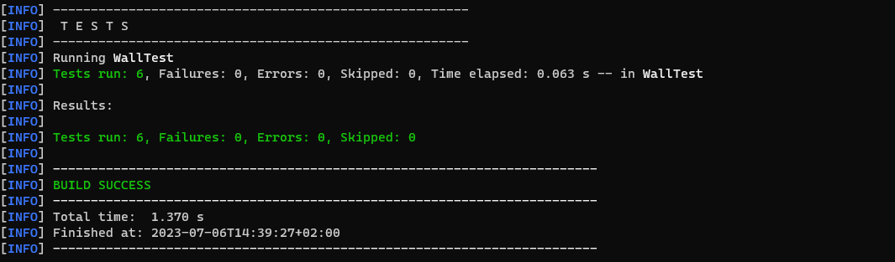

# StructureExercise

## Description 
Structure Exercise is a small Java project that solves one of the programming problems. 
The goal of the task was to implement the methods of the structure interface.
In order for the program to work properly, it was necessary to provide an implementation of the Block and CompositeBlock interfaces on which the above-mentioned methods operate.
Several tests were created in the project to check the correctness of the program's operation.

## Installation 
Java version 20 and Mavane is required to run the application.


Project download:
1. Clone a Git repository with the command: git clone https://github.com/CezaryKretkowski/StructureExercise.git
2. You can also download the project as a ZIP archive from the project's GitHub page.
3. Open  StructureExercise-master folder in terminal. 

4. Run command.
```cmd
   mvn clean install
```
5. Next go to target
```cmd
   cd target
```
6. Run application.
```cmd
  java -jar StringShop-0.0.1-SNAPSHOT.jar 
```
7. For run test go to StructureExercise-master folder and execute comannd
```cmd
  mvn test
```
## Example of use
The picture below shows the result of the tests.


